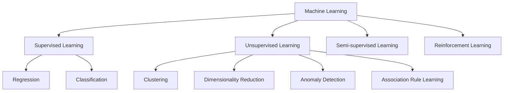

# Fundamental Types of Machine Learning

Machine Learning algorithms can be categorized using several different criteria. However, the most fundamental and universally accepted categorization is based on the **amount of supervision needed** by the algorithm during the training phase. 

Depending on the presence and extent of external supervision (labeled data), Machine Learning is broadly divided into four primary categories:
1. Supervised Machine Learning
2. Unsupervised Machine Learning
3. Semi-supervised Machine Learning
4. Reinforcement Learning

*(A high-level taxonomy of Machine Learning algorithms based on supervision)*

---

## 1. Supervised Machine Learning

### What it is
In Supervised Machine Learning, algorithms are trained on datasets that contain both **inputs** (features) and **outputs** (target labels). The objective is to learn the mathematical relationship between the input data and the corresponding output so that the model can accurately predict the output for new, unseen inputs.

### The Intuition
Imagine teaching a child to recognize fruits by showing them an apple and explicitly stating, "This is an apple." By repeatedly showing examples with their correct names (the "supervision"), the child eventually learns to identify an apple on their own. Mathematically, the model attempts to find a function $f$ such that $Y = f(X)$, where $X$ is the input and $Y$ is the output.

### Prerequisite: Understanding Data Types
To understand the subcategories of Supervised Learning, one must first recognize the two primary types of data:
*   **Numerical Data:** Continuous or discrete numbers (e.g., Age, Weight, CGPA, IQ, Salary).
*   **Categorical Data:** Qualitative labels that represent categories (e.g., Gender, Nationality, Smartphone Brand).

Based on the data type of the **output column**, Supervised Learning is split into two distinct branches: **Regression** and **Classification**.

### 1.1 Regression
If the target output variable you are trying to predict is **numerical**, the problem is known as Regression. 
*   **Example:** Predicting a student's final placement package (salary) based on their IQ and CGPA. Because the final salary is a continuous number (e.g., 4.5 LPA, 8.9 LPA), this is a regression task.

### 1.2 Classification
If the target output variable you are trying to predict is **categorical**, the problem is known as Classification.
*   **Example:** Predicting whether a student will secure a placement ("Yes" or "No") based on their IQ and CGPA.
*   **Other Examples:** Determining if an email is spam or not spam, predicting if it will rain today, or identifying whether an image contains a dog.

| Feature | Regression | Classification |
| :--- | :--- | :--- |
| **Output Type** | Numerical (Continuous) | Categorical (Discrete) |
| **Goal** | Predict a quantity | Assign a class or category |
| **Example** | Predicting house prices | Predicting loan default (Yes/No) |

---

## 2. Unsupervised Machine Learning

### What it is
Unsupervised Machine Learning involves training on datasets that contain **only inputs** without any corresponding output labels. Because there is no "correct answer" provided to the model, the algorithm cannot perform prediction in the traditional sense. Instead, its goal is to discover hidden patterns, structures, and relationships within the data.

Unsupervised Learning is generally applied through four primary techniques:

### 2.1 Clustering
**How it works:** Clustering algorithms group unlabelled data points into distinct clusters based on their similarities. Data points within the same cluster share common characteristics, while those in different clusters differ significantly.
*   **Intuition:** If you plot student data (IQ vs. CGPA) on a graph, you might naturally observe distinct "groups" of students (e.g., high IQ/high CGPA, low IQ/high CGPA) forming in the space.
*   **Where it is used:** Customer segmentation in e-commerce. By clustering customers based on purchasing behaviour, businesses can create tailored marketing strategies.
*   **Industry Advantage:** While humans can easily visualize clusters in 2D or 3D space, clustering algorithms can identify groups in highly complex, $N$-dimensional spaces where human visualization fails.

### 2.2 Dimensionality Reduction
**How it works:** This technique reduces the number of input variables (dimensions or columns) in a dataset while retaining the most important underlying information. 
*   **Why it exists:** Modern datasets (like high-resolution images or text) can have thousands of input columns. This causes two issues: it severely slows down algorithm execution, and having redundant columns often stops improving model accuracy (the "Curse of Dimensionality").
*   **Feature Extraction:** Dimensionality reduction often works by combining related columns into a single, more meaningful column. For instance, instead of having "Number of Rooms" and "Number of Washrooms" as separate features, the algorithm might extract a unified "Square Footage" feature.
*   **Visualization:** It is heavily used to compress data so it can be visualized. For example, the MNIST dataset (images of handwritten digits) has 784 dimensions (pixels). Algorithms like PCA can compress these 784 dimensions into 2 or 3 dimensions, allowing data scientists to plot and observe the relationships between different digits on a standard 3D graph.

### 2.3 Anomaly Detection
**How it works:** Anomaly detection involves identifying rare items, events, or observations that raise suspicions by differing significantly from the majority of the data (the "normal" points).
*   **Where it is used:** Detecting manufacturing defects on an assembly line, spotting fraudulent credit card transactions, or flagging suspicious loan approvals.
*   **Intuition:** The algorithm learns the boundaries of "normal" behavior. If a new data point falls drastically outside this established boundary, it is flagged as an anomaly or outlier.

### 2.4 Association Rule Learning
**How it works:** This technique uncovers interesting relations or "rules" between variables in large databases. 
*   **Where it is used:** Market Basket Analysis in retail. When arranging products in a massive supermarket, management needs to know which items are frequently bought together to optimize shelf placement. 
*   **Example:** By scanning historical purchase bills, the algorithm might discover that out of 100 times product A was bought, product B was also bought 60 times, revealing a strong association. A famous real-world case study involved Walmart discovering a strong, unintuitive correlation between customers buying baby diapers and beer. Placing these items next to each other significantly increased sales.

> **Current Industry Perspective:** While classic Association Rule algorithms (like Apriori) are foundational, modern e-commerce and streaming platforms primarily use sophisticated Deep Learning-based **Recommendation Systems** (e.g., Collaborative Filtering, Two-Tower models) to suggest related products or content.

---

## 3. Semi-supervised Machine Learning

### What it is
Semi-supervised Learning is a hybrid approach that utilizes a small amount of labeled data in conjunction with a large amount of unlabeled data during training. 

### Why it exists
Acquiring data inputs (like downloading thousands of images from the internet) is cheap and easy. However, generating the *labels* for that data requires human intervention, which is both time-consuming and highly expensive. Semi-supervised learning was developed to bypass the cost of labeling massive datasets.

### How it works (Example)
Consider **Google Photos**. The application uses unsupervised learning (clustering) behind the scenes to group similar faces together. It then asks the user to manually label just one photo in that cluster (e.g., "This is Mom"). Once you provide this single label, the system automatically propagates the label "Mom" to the rest of the clustered photos. 
*   **The Benefit:** You only exerted the effort to label one data point, but the system successfully labeled hundreds of photos autonomously.

---

## 4. Reinforcement Learning

### What it is
Reinforcement Learning (RL) differs drastically from the previous paradigms because it **does not require an initial historical dataset**. Instead, an algorithm (known as an **Agent**) learns how to behave in an **Environment** by performing actions and seeing the results.

### The Intuition
RL mimics human learning through trial and error. Just as a toddler learns to navigate a room by bumping into things (punishment) and successfully reaching toys (reward), an RL agent learns by taking actions to maximize total cumulative reward.

### How it works
1. The **Agent** observes the current state of its **Environment**.
2. It consults its **Policy** (a rulebook mapping states to actions) to decide on a move.
3. It takes the action, which alters the environment.
4. The Agent receives a **Reward** (for a good action) or a **Punishment/Negative Reward** (for a bad action).
5. The Agent updates its policy to favor actions that yield higher rewards and avoid those that result in punishment.

### Where it is used
*   **Self-Driving Cars:** Learning to navigate roads safely through simulated trial and error.
*   **Complex Board Games:** DeepMind's *AlphaGo* agent famously defeated the world champion in the highly complex game of Go by learning policies that surpassed human intuition.

> **Current Industry Perspective:** Reinforcement learning has recently seen explosive growth in Natural Language Processing. The process of Reinforcement Learning from Human Feedback (RLHF) is the core mechanism used to align modern Large Language Models (LLMs) to be helpful and safe.

---

## Key Takeaways
*   Machine Learning types are primarily defined by the **level of data supervision**.
*   **Supervised Learning** maps inputs to known outputs (labels). Use it when you have historical data with the exact target you want to predict.
*   **Unsupervised Learning** extracts structure from raw, unlabeled inputs. Use it for discovery, grouping, and data compression.
*   **Semi-supervised Learning** bridges the gap, using minimal labeled data to automatically label vast amounts of unstructured data, saving time and money.
*   **Reinforcement Learning** involves an agent learning via trial and error in an environment, optimizing for maximum rewards.

## Quick Revision
*   **Regression:** Predicting a *numerical* value (Supervised).
*   **Classification:** Predicting a *categorical* value (Supervised).
*   **Clustering:** Grouping similar data points without labels (Unsupervised).
*   **Dimensionality Reduction:** Compressing feature space to speed up models and enable visualization (Unsupervised).
*   **Anomaly Detection:** Finding rare, abnormal data points (Unsupervised).
*   **Association Rules:** Discovering items frequently occurring together (Unsupervised).

## Interview Perspective
*   **Common Pitfall:** Beginners often confuse clustering with classification. *Remember:* Classification assigns data to predefined, known categories (Supervised), while Clustering discovers previously unknown groups in raw data (Unsupervised).
*   **Frequently Tested:** Expect questions on the "Curse of Dimensionality" and why Dimensionality Reduction is necessary before applying algorithms to high-dimensional text or image data.
*   **Scenario Questions:** You will often be given a business scenario and asked which ML type to use. (e.g., "How would you detect fraudulent transactions?" -> Anomaly Detection. "How would you predict house prices?" -> Regression.)

## Related Topics
Once these fundamentals are clear, the natural next steps are:
1. Understanding the Mathematics of Simple Linear Regression.
2. Exploring Distance Metrics (Euclidean, Manhattan) used in Clustering.
3. Feature Engineering and Feature Extraction techniques (like PCA).
4. The Train/Test Split and Model Evaluation Metrics.